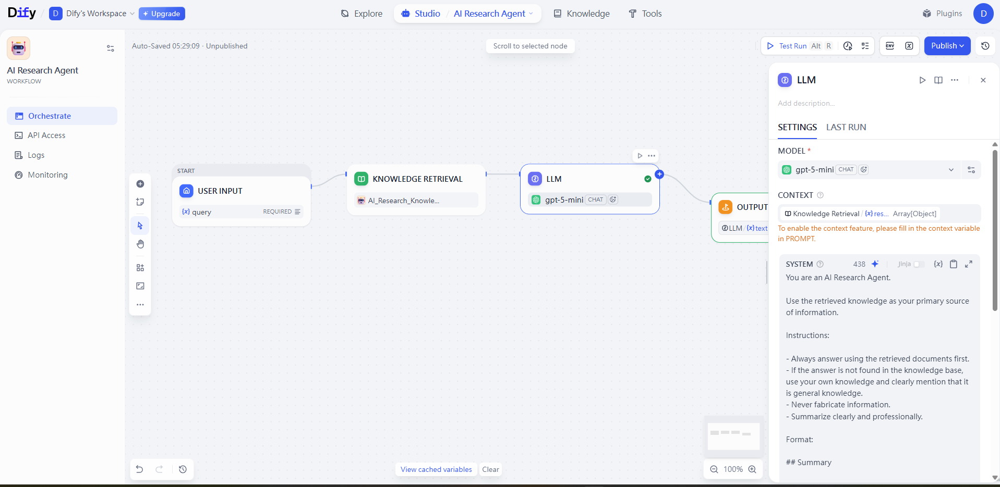
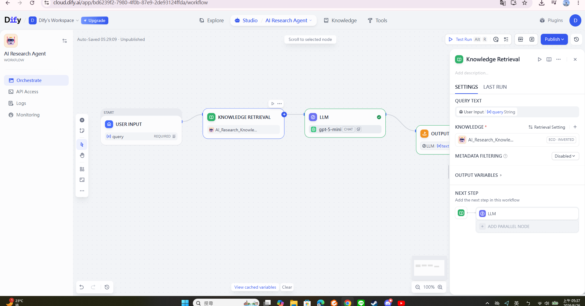
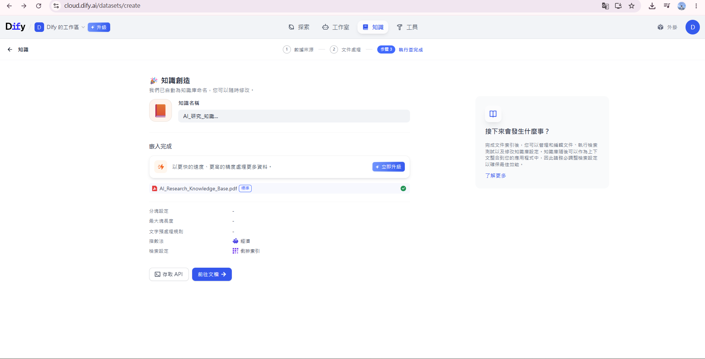
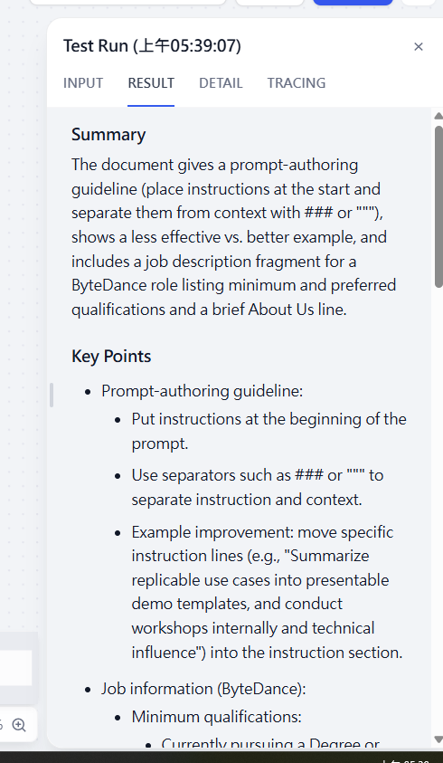

# AI Research Agent using Dify + OpenAI

An AI Research Assistant built with Dify, OpenAI GPT-5 and Retrieval-Augmented Generation (RAG).

## Features

- AI-powered research assistant
- Retrieval-Augmented Generation (RAG)
- Knowledge Base using Dify
- OpenAI GPT-5 integration
- Prompt Engineering
- Workflow Automation

## Workflow

User Question
↓
Knowledge Retrieval
↓
OpenAI GPT-5
↓
Generated Answer

### Workflow Architecture


### Dify Workflow

The complete workflow can be imported directly into Dify using the provided DSL file.

Workflow DSL:

`AI Research Agent.yml`
### Dify Workflow



## Tech Stack

- Dify
- OpenAI GPT-5
- Retrieval-Augmented Generation (RAG)
- Prompt Engineering
- Knowledge Base

## Example Questions

- Summarize the internship description.
- What skills are required?
- Compare the job description with my research.
- Explain the responsibilities.

  ## Knowledge Base



---

## Example Result



## Project Structure

```
README.md
screenshots/
knowledge/
workflow/
```

## Future Improvements

- Resume Matching
- Interview Question Generator
- Multi-document RAG
- Web Search Integration
